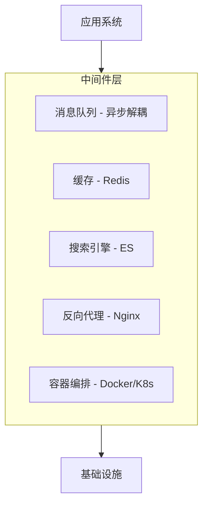

# 📖 分布式中间件一册通关（完整版）

> 定位：系统性学习分布式中间件的知识总纲
> 覆盖：Redis、消息队列（MQ）、Elasticsearch、Nginx、Docker、K8s
> 目标：每个中间件从「是什么」到「怎么用」再到「为什么」完整打通
> 学习建议：按章节顺序，一章一章吃透，不急不躁，一周扫完完全没问题

---

# 第一章：分布式中间件总览

## 1.1 到底什么算「中间件」？

**一句话：中间件 = 为应用系统提供通用能力的独立服务层。**



**费曼理解：**
没有中间件时——每个应用都要自己处理缓存、自己搞队列、自己管搜索……代码耦合在一起，改一个模块牵一发动全身。

有了中间件——缓存找 Redis，解耦找 MQ，搜索找 ES——各司其职，像乐高积木一样按需拼装。

## 1.2 你的中间件学习图谱

```
┌──────────────────────────────────────────────────────────────┐
│                    分布式中间件知识体系                       │
├──────────┬──────────┬──────────┬──────────┬──────────────────┤
│  Redis   │    MQ    │    ES    │  Nginx   │    Docker/K8s    │
├──────────┼──────────┼──────────┼──────────┼──────────────────┤
│ 5种数据结构 │ 设计哲学  │ 倒排索引  │ 反向代理  │   镜像/容器     │
│ 持久化    │ RabbitMQ │ 分词    │ 负载均衡  │    Dockerfile   │
│ 主从复制   │ 交换机类型 │ DSL查询  │ 动静分离  │    Compose编排   │
│ 哨兵/集群  │ 确认机制  │ 聚合    │ 限流     │    K8s Pod      │
│ 淘汰策略   │ 死信队列  │ 评分    │ HTTPS    │    Service/Ing  │
│ 穿透/击穿  │ 幂等     │ 集群    │ 热备     │    ConfigMap     │
│ Lua脚本   │ Kafka    │ Logstash│          │    Helm           │
│ 分布式锁   │ 吞吐对比  │ Kibana  │          │                  │
└──────────┴──────────┴──────────┴──────────┴──────────────────┘
```

---

# 第二章：Redis —— 缓存之王

## 2.1 Redis 是什么？（面试第一问）

**Redis = Remote Dictionary Server，一个基于内存的键值存储系统。**

> 费曼理解：Redis 就像一个超级快的 HashMap，但它跑在独立的服务器上，所有应用都可以通过网络访问它。快的原因很简单——数据在内存里，硬盘再快也比内存慢几个数量级。

**核心特征：**
- ✅ 纯内存操作 → 单机 QPS 10万+
- ✅ 单线程模型（6.0之前）→ 省去锁竞争
- ✅ IO多路复用 → 一个线程处理多个连接
- ✅ 丰富的数据结构 → 不只是 String/Value

## 2.2 5种基本数据结构（面试必考！）

| 类型 | 内部编码 | 一句话说明 | 典型场景 |
|------|---------|-----------|---------|
| **String** | int/embstr/raw | 最简单的键值对 | 缓存、计数器、分布式锁 |
| **List** | ziplist/linkedlist | 链表结构，双向操作 | 消息队列（简单版）、最新消息 |
| **Set** | intset/hashtable | 无序不重复集合 | 标签、去重、共同好友 |
| **ZSet** | ziplist/skiplist | 有序集合，按 score 排序 | 排行榜、延迟队列 |
| **Hash** | ziplist/hashtable | 类似 Java 的 HashMap | 对象存储（用户信息、商品详情）|

**记忆口诀：String 简单 List 序，Set 去重 ZSet 排，Hash 存对象最实在。**

### String 深入

```
SET key value          → 存
GET key                → 取
INCR key               → 原子自增（计数器神器）
SETNX key value        → 不存在才设置（分布式锁用这个）
SET key value EX 10    → 设值 + 过期时间（原子操作）
```

**使用场景：**
- 页面缓存：`SET page:homepage:html "<html>..." EX 3600`
- 计数器：`INCR article:9527:view_count`
- 分布式锁：`SET lock:order:12345 uuid NX EX 30`

### List 深入

```
LPUSH key value        → 左推（头插）
RPUSH key value        → 右推（尾插）
LPOP key               → 左弹
RPOP key               → 右弹
BLPOP key timeout      → 阻塞式左弹（可实现简单消息队列）
```

**使用场景：**
- 最新消息列表：`LPUSH news:list "标题"` + `LTRIM news:list 0 99`（只保留最近100条）
- 简单消息队列：`RPUSH task:queue "任务"` + `BLPOP task:queue 5`

### Set 深入

```
SADD key member        → 添加
SMEMBERS key           → 获取所有
SINTER key1 key2       → 交集
SUNION key1 key2       → 并集
SDIFF key1 key2        → 差集
```

**使用场景：**
- 共同关注：`SINTER user:100:follow user:200:follow`
- 抽奖去重：`SADD lottery:20260613 user_123`

### ZSet 深入（最强大的数据结构）

```
ZADD key score member  → 添加/更新
ZRANGE key 0 -1        → 按 score 从小到大取全部
ZREVRANGE key 0 9      → 取前十名（排行榜）
ZRANK key member       → 查看排名
ZSCORE key member      → 查分数
ZINCRBY key incr member → 加分
```

**使用场景：**
- 排行榜：`ZINCRBY leaderboard:game_001 100 player_9527`
- 延迟队列：按时间戳作为 score，`ZRANGEBYSCORE` 取出到时间的任务
- 带权重的任务调度

### Hash 深入

```
HSET user:100 name "张三" age 25
HGET user:100 name
HGETALL user:100
HINCRBY user:100 age 1    → 年龄+1
```

**使用场景：**
- 用户信息缓存：不用整个对象反序列化，按字段读写
- 购物车：`HSET cart:9527 item_001 2`（商品 ID → 数量）

## 2.3 过期策略

```
Redis 删除过期 key 的三种方式：

① 定时删除（没实现）
   → 设置过期时间的同时启动一个定时器
   → 内存友好，但 CPU 不友好

② 惰性删除（实现）
   → 取 key 的时候检查是否过期，过期就删
   → CPU 友好，但过期 key 可能一直占内存

③ 定期删除（实现，Redis 实际用的是 ② + ③ 的组合）
   → 每隔一段时间（默认 100ms），随机抽查部分 key，过期就删
   → 控制时长和频率，避免过度占用 CPU
```

**面试金句：** Redis 的过期删除是「定期抽查 + 惰性删除」的组合策略——既避免内存一直被过期 key 占用，又不会浪费 CPU 去精确扫每个 key。

## 2.4 内存淘汰策略（写满内存了怎么办？）

| 策略 | 含义 |
|------|------|
| **noeviction**（默认） | 内存满了拒绝写入，返回错误 |
| **allkeys-lru** | 淘汰最近最少使用的 key（推荐生产使用）|
| **allkeys-lfu** | 淘汰最不经常使用的 key |
| **volatile-lru** | 从设置了过期时间的 key 中淘汰最近最少使用的 |
| **volatile-ttl** | 淘汰即将过期的 key |
| **allkeys-random** | 随机淘汰 |

**生产推荐：`allkeys-lru`——谁最近最少用就淘汰谁，简单有效。**

```
# redis.conf
maxmemory 4gb
maxmemory-policy allkeys-lru
```

## 2.5 持久化（内存数据重启怎么恢复？）

RDB 和 AOF，是 Redis 持久化的双保险。

### RDB（快照）

```
原理：把内存数据全量 dump 到磁盘（生成 .rdb 文件）
触发方式：
  - save（同步阻塞）
  - bgsave（fork 子进程异步写，不影响主进程）
  - 自动触发（配置 save 900 1 → 900秒内至少1个key变化）

优点：文件紧凑，恢复快（一次性加载）
缺点：fork 子进程时有短暂阻塞，可能丢最后一次快照后的数据
```

### AOF（追加日志）

```
原理：每条写命令追加到 .aof 文件
三种写回策略：
  always    → 每条命令都 fsync → 安全但慢
  everysec  → 每秒 fsync → 推荐（最多丢1秒数据）
  no        → 交给 OS 刷盘 → 快但不安全

优点：数据完整性更高
缺点：文件比 RDB 大，恢复比 RDB 慢

AOF 重写（rewrite）：压缩 AOF 文件大小
  bgrewriteaof → fork 子进程重新生成最小化 AOF
```

> **生产推荐：RDB + AOF 同时开启**
> RDB 做数据恢复（快），AOF 做数据补充（全），各取所长。

## 2.6 主从复制

```
流程：
  ① Slave 向 Master 发送 SYNC 命令
  ② Master 执行 BGSAVE 生成 RDB，同时用缓冲区记录写命令
  ③ RDB 传输给 Slave，Slave 加载到内存
  ④ Master 把缓冲区的写命令发给 Slave 执行
  ⑤ 后续增量同步（命令传播）

主从配置：
  slaveof 192.168.1.100 6379
```

**主从架构的意义：**
- 读写分离（Master 写，Slave 读）
- 数据备份（Slave 做备份副本）
- 高可用基础（Master 挂了，Slave 可以顶上）

## 2.7 哨兵模式（Sentinel）

**哨兵 = 给 Redis 主从架构配的「自动故障转移」管家。**

```
哨兵集群（不少于3个哨兵实例）：
  - 监控 Master 是否存活
  - 如果多数哨兵认为 Master 挂了 → 自动选一个 Slave 升为 Master
  - 通知客户端新的 Master 地址
  
工作原理（投票制）：
  Sentinel 每 1 秒检查一次心跳
  如果 Master 在一段时间内（down-after-milliseconds）没有响应
  → 标记为主观下线（sdown）
  → 其他 Sentinel 确认 → 标记为客观下线（odown）
  → 开始选举 + 故障转移
```

## 2.8 集群模式（Cluster）

**Cluster = 真正的分布式部署——数据分片。**

```
集群核心思想：

  16384 个哈希槽（Hash Slot）
  CRC16(key) % 16384 → 决定 key 属于哪个槽
  每个节点负责一段槽区间

  节点数 = 3Master + 3Slave（最少，推荐）
  数据自动分片到不同节点

客户端访问任意节点：
  如果 key 不在当前节点 → 返回 MOVED 重定向 → 客户端跳转
```

**Redis Cluster vs 哨兵模式：**

| | 哨兵模式 | Cluster |
|--|---------|---------|
| 数据分片 | 否（所有节点存全量）| 是（自动分片到不同节点）|
| 容量上限 | 单机内存上限 | 可水平扩展 |
| 故障转移 | Sentinel 自动处理 | 自动（节点间 Gossip 协议）|
| 客户端 | 访问 Master 即可 | 需要支持 Cluster 的客户端 |
| 复杂度 | 低 | 中 |

## 2.9 缓存三大问题（面试高频）

### 缓存穿透

```
现象：请求一个不存在的数据（Redis 没有，DB 也没有）
      每次请求都打到 DB，缓存形同虚设

攻击场景：遍历不存在的 ID 请求，直接打穿 DB

解决方案：
  ① 缓存空对象（null 也缓存，设短过期时间）
  ② 布隆过滤器（Bloom Filter）拦截不可能存在的 key
```

### 缓存击穿

```
现象：某个热点 key 正好在过期瞬间
      大量并发请求同时打到 DB

解决方案：
  ① 热点 key 永不过期 + 异步更新
  ② 加互斥锁（SETNX）：只有一个线程能查 DB，其他等待
```

### 缓存雪崩

```
现象：大量 key 同时过期，或者 Redis 挂了
      所有请求全部打到 DB，DB 扛不住

解决方案：
  ① 过期时间加随机值（防止同一时间集体过期）
  ② 热点数据永不过期
  ③ 构建高可用 Redis 集群（避免单点）
  ④ 限流 + 降级（服务层面保护 DB）
```

**记忆口诀：**

```
穿透 → 不存在的 key 打 DB → 空值缓存 / 布隆过滤器
击穿 → 单个热点 key 过期 → 永不过期 / 互斥锁
雪崩 → 大量 key 同时过期 / 全挂了 → 加随机时间 / 集群高可用
```

## 2.10 分布式锁

```
最经典的实现：SETNX + Lua 脚本

加锁：
  SET lock:order:12345 uuid NX EX 30
  （NX = 不存在才设置，EX = 过期时间防止死锁）

解锁（Lua 脚本保证原子性）：
  if redis.call("get", KEYS[1]) == ARGV[1] then
      return redis.call("del", KEYS[1])
  else
      return 0
  end

为什么不能用两步操作？
  if GET(key) == uuid { DEL(key) }  ← 不是原子的！
  两个命令之间如果 key 正好过期被其他线程锁定 → 会把别人的锁解掉
```

**使用 Redisson 框架**（生产推荐，自带了看门狗机制）

```java
RLock lock = redisson.getLock("order:12345");
lock.lock(30, TimeUnit.SECONDS);
try {
    // 业务逻辑
} finally {
    lock.unlock();
}
```

## 2.11 Redis 面试高频 10 问快答

**Q1：Redis 为什么快？**
A：纯内存操作（主要）+ 单线程无锁竞争 + IO 多路复用 + C 语言实现。

**Q2：Redis 单线程为什么还能处理并发？**
A：单线程处理的是「IO 事件 + 命令处理」。IO 多路复用（epoll）让一个线程能同时处理多个客户端连接，命令是串行执行的，天然没有竞争。

**Q3：Redis 6.0 之后的 IO 多线程是怎么回事？**
A：6.0 引入多线程处理「网络 IO」部分（读写数据到内存），但命令核心处理还是单线程。网络 IO 用多线程并行，性能进一步提升。

**Q4：String 类型的最大容量？**
A：512MB。

**Q5：Redis 事务支持回滚吗？**
A：不支持。Redis 事务是「一次性执行一批命令」——如果执行前有语法错误，全部不执行；如果执行时有运行时错误（如对 String 执行 INCR），正确的照常执行，错误的跳过，不会回滚。

**Q6：怎么用 Redis 实现限流？**
A：滑动窗口（ZSet）：每个请求往 ZSet 加一个时间戳成员，ZREMRANGEBYSCORE 移除窗口外的，ZCARD 当前窗口计数。

```lua
-- Lua 脚本，原子限流
local key = KEYS[1]         -- 限流 key
local limit = tonumber(ARGV[1])  -- 限流次数
local window = tonumber(ARGV[2]) -- 窗口大小（毫秒）
local now = redis.call('TIME')[1] * 1000
redis.call('ZREMRANGEBYSCORE', key, 0, now - window)
local count = redis.call('ZCARD', key)
if count < limit then
    redis.call('ZADD', key, now, now)
    return 1  -- 通过
else
    return 0  -- 限流
end
```

**Q7：Big Key 问题是什么？**
A：单个 key 存储了超大 value（如几 MB 的字符串，或几百万成员的 Set/SortedSet）。会导致：读/写耗时增加、网络传输慢、阻塞其他命令。解决方案：拆分 key（如大 Hash 拆成多个小 Hash）。

**Q8：热 Key 问题怎么解决？**
A：热 Key（被高频访问的 key）可能导致 Redis 节点负载过高。对策：本地缓存（一级缓存）+ Redis（二级缓存）；读写分离（Slave 分担读）；热 Key 分散成多个副本。

**Q9：Redis 和 Memcached 的区别？**
A：Redis 支持更丰富数据类型、持久化、主从/集群；Memcached 只支持 String，不支持持久化，多线程。Redis 更常用于业务系统，Memcached 更纯粹做缓存。

**Q10：怎么保证缓存和数据库的一致性？**
A：读：先读缓存→没有读 DB→写入缓存。写：更新 DB → 删除缓存（延迟双删）。或者用 Canal 监听 MySQL binlog → 异步同步到 Redis。

---

# 第三章：消息队列（MQ）—— 异步解耦的核心

> 完整 MQ 知识已在《MQ综合专题-消息中间件通关手册.md》中详细讲解
> 本章为精简速查版，用于复习和快速回顾

## 3.1 MQ 解决了什么问题？

```
① 异步解耦 — 核心业务流程不需要等待非核心操作
② 削峰填谷 — 将突发流量缓存到队列中，消费者按自身能力消费
③ 流量控制 — 生产者快慢不会直接影响消费者
```

## 3.2 RabbitMQ 速记

### 核心架构

```
Producer → Exchange → (Binding) → Queue → Consumer
              ↑                        ↑
          路由决策层                存储层
```

### 4种交换机（面试死记）

| 类型 | 路由规则 | 一句话记忆 |
|------|---------|-----------|
| **Direct** | routing key 精确匹配 | 精确配送 |
| **Fanout** | 忽略 routing key，全部转发 | 大喇叭广播 |
| **Topic** | `*` 匹配一个词，`#` 匹配0或多个 | 模糊配送 |
| **Headers** | 按消息 headers 属性匹配 | 看特征配送 |

### 消息可靠性（三条护法线）

```
① 生产者 → Exchange 丢失 → Publisher Confirm
② Exchange → Queue 丢失 → mandatory=true + ReturnCallback
③ Queue → 消费者丢失 → 手动 ACK
```

### 死信队列

```
死信三来源：
  - 消费者 basicNack(requeue=false)
  - 消息 TTL 过期
  - 队列满了

死信去向：原队列的 dead-letter-exchange → 死信队列 → 死信消费者
```

### 延迟队列

```
① TTL + DLX（原生方案，有顺序问题）
② rabbitmq-delayed-message-exchange 插件（推荐）
```

## 3.3 Kafka 速记

### 核心架构

```
Producer → Topic [Partition0] [Partition1] [Partition2] → Consumer Group
                    ↕ 每个 Partition 是有序的追加日志
                  3副本（replication-factor=3）
```

### Kafka vs RabbitMQ

| 维度 | Kafka | RabbitMQ |
|------|-------|----------|
| 设计定位 | 分布式流平台 | 消息代理 |
| 吞吐量 | 百万级/秒 | 万级/秒 |
| 消息模型 | Topic-Partition | Exchange-Queue |
| 消息删除 | 按保留策略（时间/大小） | 消费后立即删除 |
| 消息回溯 | 支持（重置 offset） | 不支持 |
| 延迟 | 毫秒级（Pull 模式） | 微秒级（Push 模式）|
| 消息顺序 | Partition 内有序 | 单队列有序 |

### Kafka 高吞吐的原因

```
① 顺序写磁盘（比随机写快 1000 倍）
② 零拷贝（数据从磁盘直接到网卡）
③ 批量发送 + 批量压缩
④ Partition 并行
```

### Kafka 消息不丢失的三端保障

```
Producer: acks=all + 幂等生产者 + retries
Broker:    replication-factor≥3 + min.insync.replicas≥2
Consumer: 先处理业务再提交 offset（手动提交）
```

## 3.4 消息队列核心考点

<details>
<summary>点击展开面试高频 Q&A</summary>

**Q1：怎么保证消息不丢失？**
A：见上面三条护法线。核心：Confirm + 持久化 + 手动 ACK。

**Q2：消息重复消费怎么办？**
A：幂等性。问题不复位唯一约束，Kafka 天然不幂等，业务层自己处理（数据库唯一键 / Redis 标记）。

**Q3：消息顺序怎么保证？**
A：RabbitMQ 单队列单消费者；Kafka 同一 key 哈希到同一 Partition。

**Q4：消息积压怎么处理？**
A：排查 Ready 增长 → 看消费者日志（慢 SQL? 异常?） → 增加并发 / 优化业务 / 紧急扩容。

**Q5：RabbitMQ 和 Kafka 怎么选？**
A：业务解耦 / 灵活路由 → RabbitMQ；高吞吐 / 日志管道 / 流计算 → Kafka。

</details>

---

# 第四章：Elasticsearch — 搜索引擎

> ES 现在是后端工程师的标配技能了，面试也高频，至少要懂原理和核心概念。

## 4.1 ES 是什么？（一句话）

**Elasticsearch = 基于 Lucene 的分布式搜索引擎，支持全文搜索、结构化搜索、数据分析。**

> 费曼理解：MySQL 的 LIKE '%关键词%' 不走索引，亿级数据时慢到无法接受。ES 是一种专门为「搜索」设计的数据库——建倒排索引，分词处理，搜索速度是毫秒级的。

## 4.2 核心概念（对照 MySQL 理解）

| MySQL | ES | 说明 |
|-------|-----|------|
| Database | Index（索引） | 数据分类的逻辑空间 |
| Table | Type（已废弃，现在用 _doc） | 同一索引下的文档分类 |
| Row | Document | 一条数据，JSON 格式 |
| Column | Field | 一个字段 |
| Index | Mapping | 字段类型定义（类似 Schema）|
| SQL | DSL | ES 的查询语言，基于 JSON |

```
索引（Index）= 数据库
  └─ 文档（Document）= 一行数据，JSON 格式
       └─ 字段（Field）= 每个键值对都对应一个字段类型
            └─ 分词器（Analyzer）= 真·搜索的关键！
```

## 4.3 倒排索引（为什么 ES 搜得快？）

```
正排索引（MySQL 的 LIKE）：
  文档1: "我爱北京天安门"
  文档2: "北京欢迎你"
  
  搜索"北京" → 扫描所有文档 → 逐字匹配 → 文档1有，文档2有
  复杂度 O(n × m) → 数据量大就慢

倒排索引（ES）：
  分词 → 建立词 → 文档的映射关系：
  
  "北京" → [文档1, 文档2]
  "天安门" → [文档1]
  "欢迎" → [文档2]
  
  搜索"北京" → 直接查倒排表 → 拿到 [文档1, 文档2]
  复杂度 O(1) → 永远毫秒级
```

**倒排索引的构建步骤：**
```
原始文档 → 分词器（Analyzer） → 一个个词条（Term） → 词条→文档ID（倒排表）
                ↑
          这是 ES 的精华——
          不同的分词器产生不同的搜索结果
```

## 4.4 分词器（Analyzer）

```
分析器 = 字符过滤器（Character Filter）+ 分词器（Tokenizer）+ 词项过滤器（Token Filter）

常见分词器：
  standard     → 标准分词器，按空格和标点切分（适合英文）
  ik_smart     → IK 中文分词，粗粒度（适合搜索）
  ik_max_word  → IK 中文分词，细粒度（适合索引）
  whitespace   → 按空格切分
  keyword      → 不分词，整个字段作为一个词条

中文推荐：IK 分词器（ik_smart 搜索用，ik_max_word 索引用）
```

## 4.5 DSL 查询（ES 的 SQL）

### 查询 vs 过滤

```
查询（Query）：计算相关性评分（_score），按相关度排序
  → 适合全文搜索

过滤（Filter）：只判断是否匹配（yes/no），不评分，可缓存
  → 适合精确匹配、范围查询、时间过滤
```

### 常用查询

```json
// 全文搜索 match
GET /article/_search
{
  "query": {
    "match": {
      "title": "分布式中间件"
    }
  }
}

// 精确匹配 term（不分词）
GET /article/_search
{
  "query": {
    "term": {
      "status": "PUBLISHED"
    }
  }
}

// 多条件组合 bool
GET /article/_search
{
  "query": {
    "bool": {
      "must":     { "match": { "title": "Java" } },      // 必须匹配
      "filter":   { "term":  { "status": "ACTIVE" } },   // 必须匹配（不评分）
      "must_not": { "range": { "publishDate": { "lt": "2020-01-01" } } },
      "should":   { "match": { "content": "高并发" } }   // 匹配加分
    }
  }
}

// 范围查询 range
GET /order/_search
{
  "query": {
    "range": {
      "createTime": {
        "gte": "2026-06-01",
        "lte": "2026-06-13"
      }
    }
  }
}

// 分页 + 排序
GET /article/_search
{
  "from": 0,
  "size": 20,
  "sort": [
    { "publishDate": "desc" }
  ]
}
```

## 4.6 聚合（Aggregation）— ES 的 GROUP BY

```json
// 按状态分组统计
GET /article/_search
{
  "size": 0,
  "aggs": {
    "by_status": {
      "terms": {
        "field": "status",
        "size": 10
      }
    }
  }
}

// 嵌套聚合——按状态分组后求平均字数
GET /article/_search
{
  "size": 0,
  "aggs": {
    "by_status": {
      "terms": { "field": "status" },
      "aggs": {
        "avg_word_count": {
          "avg": { "field": "wordCount" }
        }
      }
    }
  }
}
```

## 4.7 ES 集群架构

```
Node Types（节点角色）：
  Master Node     → 负责集群管理（元数据、分片分配）
  Data Node       → 负责存储数据、执行 CRUD 和搜索
  Coordinating Node → 负责接收客户端请求，分发到其他节点，汇总结果
  Ingest Node     → 负责数据预处理

生产推荐：Master 和 Data 分离，至少 3 个 Master 节点。
```

## 4.8 ELK 技术栈

```
Logstash（数据采集管道）→ Elasticsearch（存储 + 搜索）→ Kibana（可视化）

企业常见架构：
  应用日志 → Filebeat（轻量采集）→ Logstash（过滤加工）→ ES（存储搜索）→ Kibana（展示）
```

## 4.9 ES 面试速答

**Q1：ES 为什么搜索快？**
A：倒排索引——不是扫描文档，而是查词条到文档的映射表，复杂度 O(1)。

**Q2：什么是分片？**
A：分片 = 数据水平拆分，一个索引默认拆成 5 个主分片，每个主分片可配副本分片。

**Q3：什么是倒排索引？**
A：词条 → 文档ID 的映射。好比书的目录——告诉你某个词出现在哪几页。

**Q4：分词器的作用？**
A：把原始文本拆成搜索用的词条。不同的分词器产生不同的词条，搜索结果也不同。

---

# 第五章：Nginx — 高性能网关

> Nginx 是 Web 服务器届的「扫地僧」——看着不起眼，但几乎所有大厂都在用。
> 反向代理、负载均衡、动静分离、限流、HTTPS，一个软件全搞定。

## 5.1 Nginx 是什么

**Nginx = 高性能的 HTTP 和反向代理 Web 服务器，同时也提供 IMAP/POP3 代理服务。**

> 费曼理解：Nginx 就像公司前台——所有请求先到前台，前台判断：
> - 静态文件（图片/CSS）→ 前台直接拿给你（自己处理）
> - 需要处理的 → 前台分配到对应部门（交给后端服务器）
> - 某个部门忙不过来 → 前台排队或拒绝（限流）
> - 前台出了事 → 备用前台顶上（热备）

## 5.2 核心功能

```
┌───────────────────────────────┐
│           用户请求             │
└──────────────┬────────────────┘
               │
               ▼
        ┌──────────────┐
        │   Nginx      │   ← 代理层
        │  80/443端口  │
        └──────┬───────┘
               │
       ┌───────┼───────────────┐
       │       │               │
       ▼       ▼               ▼
   ┌──────┐ ┌──────┐        ┌──────┐
   │静态   │ │ServiceA │        │ServiceB│
   │资源   │ │(API)   │        │(API)   │
   └──────┘ └──────┘        └──────┘
```

### 反向代理

```
请求 → Nginx → 后端服务器
                用户不知道后端是谁，Nginx 隐藏了后端细节

反向代理好处：
  - 隐藏后端服务器真实 IP
  - 统一入口（所有请求都走 Nginx）
  - 可以做负载均衡、限流、缓存
```

### 正向代理 vs 反向代理

```
正向代理（VPN/梯子）：你找一个代理去访问目标服务器
  客户端 → 代理服务器 → 目标服务器
  目标服务器知道是代理在访问，不知道是你

反向代理（Nginx）：你访问一个代理，它帮你转给后端
  客户端 → Nginx → 后端服务器
  你不知道后端是谁，只知道 Nginx
```

### 负载均衡策略

```
http {
    upstream backend {
        # 默认：轮询
        server 192.168.1.10:8080;
        server 192.168.1.11:8080;

        # 加权轮询
        # server 192.168.1.10:8080 weight=3;
        # server 192.168.1.11:8080 weight=1;
    }

    server {
        listen 80;
        location / {
            proxy_pass http://backend;
        }
    }
}

其他策略：
  ip_hash      → 同一 IP 的请求始终打到同一台机器（解决 Session 问题）
  least_conn   → 分给当前连接数最少的那台
  least_time   → 分给响应时间最短的那台
  consistent_hash → 一致性哈希，分布式缓存神器
```

### 动静分离

```
server {
    listen 80;

    # 静态资源 → Nginx 直接返回（速度快，不经过后端）
    location /static/ {
        alias /data/www/static/;
        expires 7d;           # 浏览器缓存 7 天
        add_header Cache-Control "public, immutable";
    }

    # API 请求 → 转发到后端
    location /api/ {
        proxy_pass http://backend_server;
        proxy_set_header Host $host;
        proxy_set_header X-Real-IP $remote_addr;
    }
}
```

### 限流

```nginx
# 定义限流区域：1秒1个请求，允许突发5个
limit_req_zone $binary_remote_addr zone=mylimit:10m rate=1r/s;

server {
    location /api/ {
        limit_req zone=mylimit burst=5 nodelay;
        proxy_pass http://backend;
    }
}
```

### HTTPS 配置

```nginx
server {
    listen 443 ssl;
    server_name example.com;

    ssl_certificate     /etc/nginx/certs/example.com.pem;
    ssl_certificate_key /etc/nginx/certs/example.com.key;

    ssl_protocols TLSv1.2 TLSv1.3;
    ssl_ciphers HIGH:!aNULL:!MD5;

    location / {
        proxy_pass http://backend;
    }
}

# HTTP → HTTPS 跳转
server {
    listen 80;
    server_name example.com;
    return 301 https://$server_name$request_uri;
}
```

### 热备（Keepalived + Nginx 双机主备）

```
主 Nginx 挂了 → 备用 Nginx 自动接手 → 虚拟 IP 漂移

Keepalived 通过 VRRP 协议实现：
  主备之间互相心跳检测
  主挂了 → 备接管虚拟 IP → 客户端无感知
```

## 5.3 Nginx 架构特点

```
Nginx 性能好的原因：

① 多进程（Master + Worker）：
   Master 进程管理配置和工作进程
   Worker 进程处理请求（数量 = CPU 核心数）

② 异步非阻塞事件驱动：
   就像一个客服同时处理多个客户，不是"一个客服一次接一个客"
   epoll IO 多路复用 → 一个 Worker 可以处理成千上万个连接

③ 内存占用极低：
   一万个连接只占几 MB 内存
```

## 5.4 Nginx 面试速答

**Q1：Nginx 和 Apache 的区别？**
A：Nginx 事件驱动，异步非阻塞，连接高并发性能好；Apache 进程驱动，每个连接占用进程/线程，并发高时内存占用大。

**Q2：Nginx 如何处理高并发？**
A：Master 管理 + Worker 异步非阻塞 + epoll——少量进程处理海量连接。

**Q3：Nginx 负载均衡怎么配置？**
A：upstream + proxy_pass，支持轮询、加权、ip_hash、least_conn 等。

**Q4：正向代理和反向代理的区别？**
A：正向代理隐藏客户端（如 VPN），反向代理隐藏服务器（如 Nginx）。

---

# 第六章：Docker — 容器化部署

> Docker 让「在我机器上能跑」成为历史。你现在应该已经会用了，这里做系统梳理。

## 6.1 Docker 是什么

**Docker = 容器化技术，把应用及其依赖打包到一个「镜像」中，在任何机器上都能运行。**

> 费曼理解：Docker 就像「打包搬家」——传统部署是在新机器上重新配环境（JDK、MySQL、Redis……），Docker 是把整个环境 + 应用打包成一个箱子（镜像），到新机器上解压就能跑（容器）。

```
传统部署：
  买服务器 → 装系统 → 装 JDK + Maven + MySQL → 配环境变量 → 部署应用 → 跑了可能有环境差异

Docker 部署：
  写 Dockerfile（定义环境和依赖）→ Build 成镜像 → push 到仓库 → pull 到任意机器 → run 容器 → 永远一样
                                                                           ↑
                                                                      环境完全一致
```

## 6.2 核心概念

| 概念 | 类比 | 说明 |
|------|------|------|
| **镜像（Image）** | 类（Class） | 只读模板，包含应用 + 环境 |
| **容器（Container）** | 实例（Instance）| 镜像运行起来的实例，可读可写 |
| **Dockerfile** | 类的定义代码 | 构建镜像的配方 |
| **仓库（Registry）** | Git 远程仓库 | 存储和分发镜像 |
| **Docker Compose** | 多容器编排 | 一键启动多个相关容器 |

## 6.3 常用命令速查

```bash
# 镜像
docker images                    # 查看镜像
docker pull nginx:latest         # 拉取镜像
docker build -t my-app:1.0 .     # 构建镜像
docker rmi my-app:1.0            # 删除镜像

# 容器
docker ps                        # 运行中的容器
docker ps -a                     # 所有容器（含已停止）
docker run -d --name myapp -p 8080:8080 my-app:1.0
docker stop myapp                # 停止容器
docker start myapp               # 启动已停止的容器
docker rm myapp                  # 删除容器
docker logs -f myapp             # 查看日志
docker exec -it myapp bash       # 进入容器

# 网络 + 数据卷
docker network create mynet      # 创建网络
docker volume create mydata      # 创建数据卷（持久化数据）

# 其他
docker commit container_id new_image:tag  # 把容器保存为新镜像（不推荐，用 Dockerfile）
docker save -o myapp.tar my-app:1.0       # 导出镜像
docker load -i myapp.tar                   # 导入镜像
```

## 6.4 Dockerfile 写法（核心）

```dockerfile
# 基础镜像（越小越好，推荐 alpine 版本）
FROM openjdk:17-slim

# 作者信息
LABEL author="your-name" version="1.0"

# 设置工作目录
WORKDIR /app

# 复制 jar 包到镜像
COPY target/myapp.jar app.jar

# 暴露端口
EXPOSE 8080

# 启动命令
ENTRYPOINT ["java", "-jar", "app.jar"]
```

**多阶段构建（减少镜像体积）：**

```dockerfile
# 第一阶段：编译
FROM maven:3.8-jdk-17 AS builder
WORKDIR /build
COPY pom.xml .
RUN mvn dependency:go-offline    # 下载依赖（充分利用缓存）
COPY src ./src
RUN mvn package -DskipTests

# 第二阶段：运行
FROM openjdk:17-slim
WORKDIR /app
COPY --from=builder /build/target/myapp.jar app.jar
EXPOSE 8080
ENTRYPOINT ["java", "-jar", "app.jar"]
# ← 最终镜像只有运行环境 + jar包，没有 Maven 和源代码
```

## 6.5 Docker Compose（多容器编排）

```yaml
version: '3.8'

services:
  mysql:
    image: mysql:8.0
    environment:
      MYSQL_ROOT_PASSWORD: root123
      MYSQL_DATABASE: myapp
    volumes:
      - mysql_data:/var/lib/mysql  # 数据挂载到宿主机
    ports:
      - "3306:3306"

  redis:
    image: redis:7-alpine
    ports:
      - "6379:6379"

  app:
    build: .
    depends_on:      # 等待 mysql 和 redis 启动后再启动 app
      - mysql
      - redis
    ports:
      - "8080:8080"
    environment:
      SPRING_DATASOURCE_URL: jdbc:mysql://mysql:3306/myapp
      SPRING_REDIS_HOST: redis

volumes:
  mysql_data:  # 声明命名卷
```

## 6.6 Docker 面试速答

**Q1：Docker 和虚拟机有什么区别？**
A：虚拟机虚拟整个操作系统（包括内核），Docker 共享宿主机内核，只隔离进程。Docker 启动秒级，虚拟机分钟级；Docker 资源利用率更高。

**Q2：Docker 网络模式有哪些？**
A：bridge（默认，容器间隔离）、host（与宿主机共享网络）、none（无网络）、overlay（跨主机通信，Swarm/K8s 用）。

**Q3：镜像分层原理？**
A：Docker 镜像由只读层叠加，每一层 Dockerfile 一条指令。分层的好处是：相同的层可以复用（基础镜像层、依赖层），节省磁盘和网络传输。

**Q4：如何减小 Docker 镜像体积？**
A：用 alpine 基础镜像、多阶段构建、合并 RUN 命令减少层数、删除不必要的包和缓存。

---

# 第七章：Kubernetes（K8s）—— 容器编排的工业标准

> Docker 解决了「一个容器怎么跑」，K8s 解决了「成百上千个容器怎么管理」。
> 这是大厂的标配，也是面试加分项。

## 7.1 K8s 是什么

**Kubernetes = 自动化的容器编排平台——部署、扩缩容、服务发现、负载均衡、自愈。**

> 费曼理解：如果 Docker 是集装箱，K8s 就是港口管理系统。它自动决定集装箱放哪个货轮（节点）、货轮坏了怎么办（自愈）、货多了自动多调几艘船（水平扩缩）。

## 7.2 核心概念

### Pod（最小调度单位）

```
Pod = 一个或多个容器的组合，共享网络和存储
      ┌──────────────┐
      │     Pod      │
      │ ┌────┐ ┌───┐ │
      │ │App │ │Log│ │  ← 一个 Pod 可包含多个容器
      │ └────┘ └───┘ │
      │   IP: 10.1.0.5 │
      └──────────────┘

Pod 的特点：
  - 最小的调度单位（K8s 不会调度单个容器，只调度 Pod）
  - 每个 Pod 有独立的 IP
  - Pod 是"临时"的——挂掉后会被重建（IP 会变）
```

### Deployment（无状态应用管理）

```
Deployment = 管理 Pod 的「期望状态」

apiVersion: apps/v1
kind: Deployment
metadata:
  name: myapp
spec:
  replicas: 3          # 期望 3 个副本
  selector:
    matchLabels:
      app: myapp
  template:
    metadata:
      labels:
        app: myapp
    spec:
      containers:
      - name: myapp
        image: myapp:1.0
        ports:
        - containerPort: 8080

Deployment 的能力：
  - 滚动更新（逐步替换旧 Pod → 新 Pod）
  - 回滚（发现更新的有问题，一键回到上一个版本）
  - 水平扩缩（修改 replicas 自动增删 Pod）
  - 自愈（Pod 挂了自动拉起新 Pod）
```

### Service（稳定的访问入口）

```
Service = 给一组 Pod 固定的虚拟 IP + 负载均衡

为什么需要 Service？
  Pod 的 IP 是临时的不固定，挂掉重建会变
  Service 提供一个固定的访问入口，自动转发到健康的 Pod

apiVersion: v1
kind: Service
metadata:
  name: myapp-service
spec:
  selector:
    app: myapp          # 选择哪些 Pod（通过标签）
  ports:
  - port: 80            # Service 端口
    targetPort: 8080     # Pod 容器端口
  type: ClusterIP       # 类型

Service 类型：
  ClusterIP → 仅在集群内部可访问（默认）
  NodePort  → 在每台节点上暴露一个端口，外部可通过 NodeIP:NodePort 访问
  LoadBalancer → 云厂商自动分配负载均衡器（如 AWS ELB）
```

### Ingress（外部访问统一入口）

```
Ingress = 7 层路由规则，类似 Nginx 的反向代理

                  ┌─────────┐
  用户请求 ──────▶│   Ingress  │─────▶ Service
                  │  (规则)   │
                  └─────────┘

apiVersion: networking.k8s.io/v1
kind: Ingress
metadata:
  name: myapp-ingress
spec:
  rules:
  - host: api.myapp.com              # 域名匹配
    http:
      paths:
      - path: /api
        pathType: Prefix
        backend:
          service:
            name: myapp-service
            port:
              number: 80
```

### ConfigMap & Secret（配置管理）

```yaml
# ConfigMap：存储非机密配置
apiVersion: v1
kind: ConfigMap
metadata:
  name: app-config
data:
  application.yml: |
    server:
      port: 8080
    spring:
      datasource:
        url: jdbc:mysql://mysql:3306/myapp

# Secret：存储敏感信息（Base64 编码）
apiVersion: v1
kind: Secret
metadata:
  name: db-secret
type: Opaque
data:
  password: cm9vdDEyMw==  # "root123" 的 Base64
```

## 7.3 K8s 核心机制

### 声明式 API

```
这是 K8s 的核心理念——「你说要啥，它负责实现」

命令式（传统）："再给我起一个容器"
声明式（K8s）： "我最终要有 3 个副本"

K8s 的 Controller：
  1. 看到声明（replicas: 3）
  2. 对比当前状态（目前在跑 3 个 Pod）
  3. 如果多了就删，少了就起
  4. 不断循环 → 使实际状态趋近于期望状态
```

### 自动扩缩容（HPA）

```yaml
apiVersion: autoscaling/v2
kind: HorizontalPodAutoscaler
metadata:
  name: myapp-hpa
spec:
  scaleTargetRef:
    apiVersion: apps/v1
    kind: Deployment
    name: myapp
  minReplicas: 2
  maxReplicas: 10
  metrics:
  - type: Resource
    resource:
      name: cpu
      target:
        type: Utilization
        averageUtilization: 70
```

## 7.4 Docker 和 K8s 的关系

```
Docker 做「一件事」—— 运行容器
K8s 做「所有事」—— 管理容器的完整生命周期

关系类比：
  Docker = 引擎
  K8s   = 自动驾驶系统

实际部署：
  开发机（Docker 写 Dockerfile 构建镜像）
    → 镜像仓库（推送到 Docker Hub / Harbor）
    → K8s 集群（拉取镜像 → 创建 Pod → 对外暴露 Service）
```

---

# 第八章：其他常见中间件速览

## 8.1 ZooKeeper

```
定位：分布式协调服务

核心功能：
  - 命名服务（服务注册与发现，类似 Eureka）
  - 配置管理（统一管理分布式系统的配置）
  - 分布式锁（基于临时顺序节点）
  - 集群管理（Leader 选举）

数据结构：树形节点（类似文件系统），每个节点叫 ZNode
```

## 8.2 Gateway（网关）

```
定位：微服务架构的统一入口

常见产品：
  Spring Cloud Gateway（基于 WebFlux，响应式）
  Zuul 1.x（基于 Servlet，阻塞式，已淘汰）

核心功能：
  路由转发、鉴权、限流、熔断、日志、协议转换

和 Nginx 的区别：
  Nginx 是软负载均衡（7层+4层），适合流量入口
  Gateway 是微服务网关，适合内部服务路由 + 跨横切关注点
```

## 8.3 Sentinel / Hystrix（服务治理）

```
定位：服务稳定性保障

核心功能：
  - 熔断（一条路不通就绕行，给服务恢复时间）
  - 限流（控制流量速率）
  - 降级（非关键服务不可用时，返回默认结果，不阻塞主流程）

对比：
  Hystrix（Netflix 出品，已停更）
  Sentinel（阿里出品，活跃维护，功能更丰富）
```

---

# 第九章：中间件面试高频背诵表

## 面试官常问的 10 道综合题

| # | 问题 | 一句话答案 |
|---|------|-----------|
| 1 | Redis 为什么这么快？ | 纯内存 + 单线程 + IO 多路复用 |
| 2 | 缓存穿透/击穿/雪崩？ | 穿透（不存在key），击穿（热点key过期），雪崩（大量key同时过期）|
| 3 | MQ 消息丢失怎么处理？ | 生产者 Confirm + 持久化 + 手动 ACK |
| 4 | MQ 消息重复怎么办？ | 幂等设计（数据库唯一约束 / Redis 标记）|
| 5 | RabbitMQ 和 Kafka 区别？ | RabbitMQ 灵活路由，Kafka 高吞吐流处理 |
| 6 | ES 为什么搜索快？ | 倒排索引，词条到文档的映射 |
| 7 | Nginx 如何处理高并发？ | 多进程 + 异步事件驱动 + epoll |
| 8 | Docker 和虚拟机区别？ | Docker 共享内核，启动秒级；VM 完整 OS，启动分钟级 |
| 9 | K8s Pod 是什么？ | 最小调度单位，一个或多个容器的组合 |
| 10 | 怎么搭建一套高可用系统？ | Redis 哨兵/集群 + MQ 集群 + Nginx 热备 + 多活部署 |

---

# 附录：速记口诀汇总

## Redis 速记

```
String 简单 List 序，Set 去重 ZSet 排，Hash 存对象最实在。
穿透空值布隆挡，击穿永不过期扛，雪崩加随机+集群。

主从复制读写分，哨兵挂了自动换，Cluster 分片真分布。
RDB快照恢复快，AOF日志不丢数，两者都开最保险。
```

## MQ 速记

```
RabbitMQ：生产者→交换机→绑定→队列→消费者
Ex 四种：Direct精确送，Fanout到处送，Topic模糊送，Headers看特征
死信：Nack/超时/队列满 → DLX 自动转

Kafka：Topic 分 Partition，Partition 存日志，消费者组内分摊
不丢：acks=all + 副本3 + 手动提交 offset
快：顺序写 + 零拷贝 + 批量 + 并行
```

## ES 速记

```
倒排索引快如飞，分词器决定搜到谁
Query算分 Filter缓存，Bool组合一手遮天
```

## Nginx 速记

```
反向代理藏后端，负载均衡分压力，动静分离缓静态
HTTPS 一套配齐，Keepalived 保活备
```

## Docker & K8s 速记

```
Dockerfile 定镜像，Compose 编排服务群
K8s Deploy 管副本，Service 固定入口，Ingress 做网关
Pod 临时随时换，声明式 API 最省心
```

---

> **「中间件」从来不是一个个孤立的工具，而是一整个生态。**
>
> 建议学习顺序：
> 1. **Redis**（最常用，最快见效）
> 2. **MQ**（面试高频，但业务中用得相对少一些）
> 3. **ES**（需要搜索的才会用到，原理重要）
> 4. **Nginx**（运维基础，后端也要理解）
> 5. **Docker**（当前标配，不会 Docker 寸步难行）
> 6. **K8s**（进阶，大厂面试加分项）
>
> 每学一个，就想想：**它解决了什么问题？不用它会怎样？它的短板是什么？**
> 带着这三个问题学，中间件的知识体系就能立起来。
